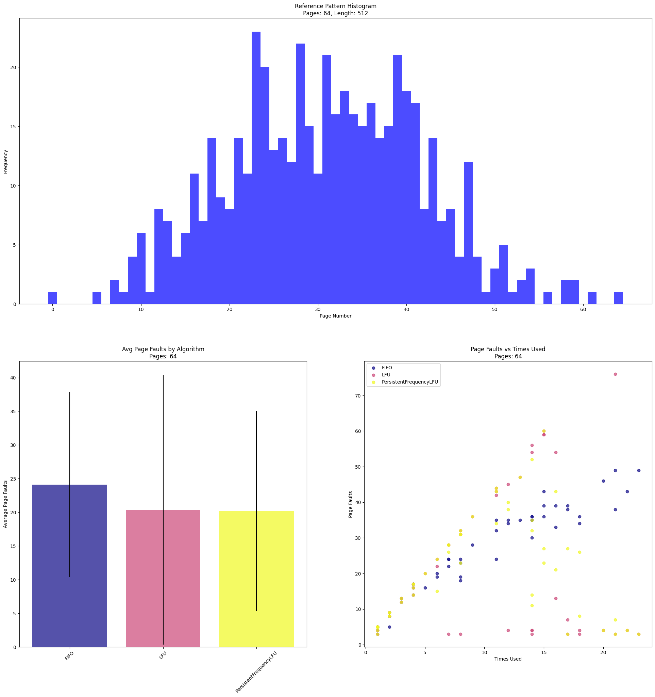
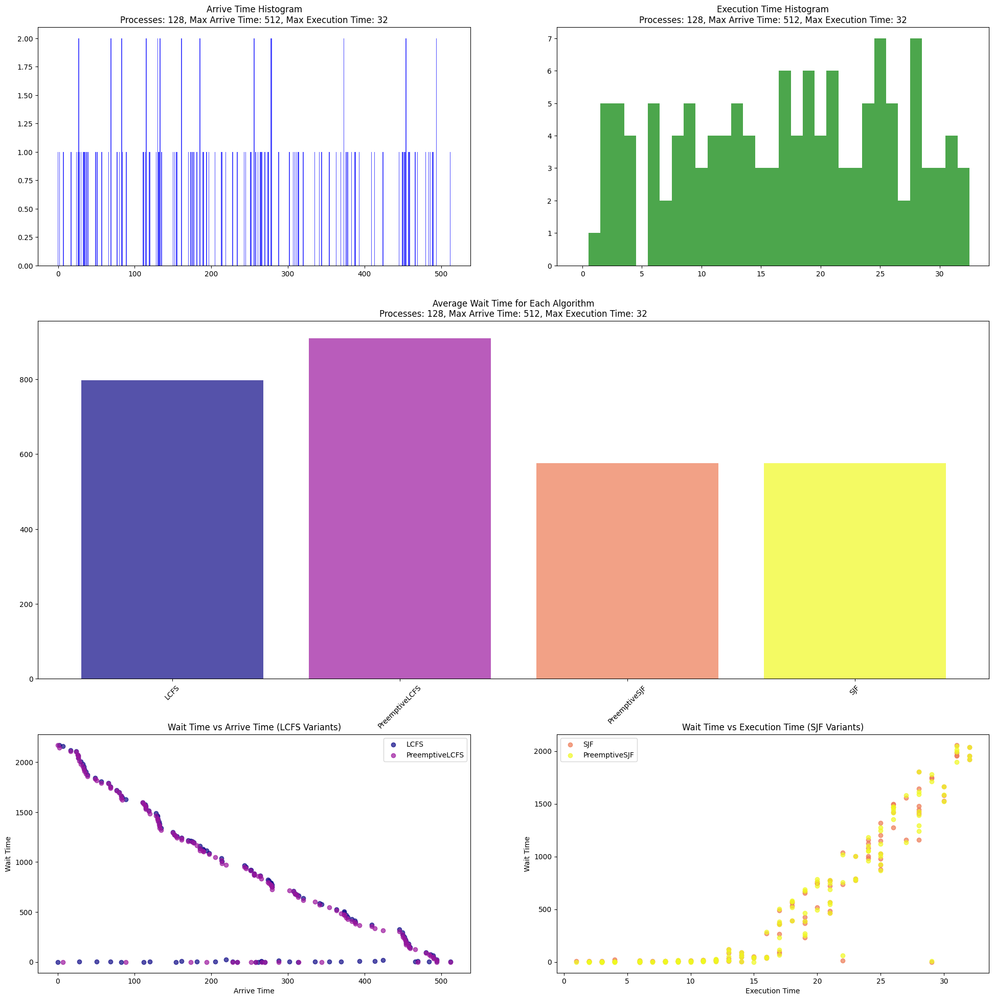

# CPU Scheduling Simulator
[](LICENSE)
[](https://godoc.org/github.com/kaykoe/cpu-scheduling-sim)

A project to simulate various CPU scheduling and page replacement algorithms, done as a project for an Operating Systems course at Wroclaw University of Science and Technology.

## Table of Contents

- [Introduction](#introduction)
- [Features](#features)
- [Installation](#installation)
- [Usage](#usage)
- [License](#license)

---

## Introduction

This repository provides a simulator for different CPU scheduling algorithms written in Go, as well as a Jupyter Notebook used to generate graphs for visualizations, and analysis.

## Features

- Supports multiple CPU scheduling algorithms:
  - First-Come, First-Serve (FCFS)
    - Preemptive and Non-Preemptive versions
  - Shortest Job First (SJF)
    - Preemptive and Non-Preemptive versions
- Supports multiple page replacement algorithms:
  - First-In, First-Out (FIFO)
  - Least Frequently Used (LFU)
    - Persistent and Non-Persistent versions
- Visualizations using Jupyter Notebooks.
- sim.py python script to run simulations in a batch
- pre built executable for x86_64 Linux at src/src and Windows at src/src.exe

### Example Plots


## Installation

### Prerequisites

  Make sure you have the following installed on your machine:
  - python
  - [Poetry](https://github.com/python-poetry/poetry)
  - go
1. Clone the repository:
   ```bash
   git clone https://github.com/kaykoe/cpu-scheduling-sim.git
   cd cpu-scheduling-sim
   ```
2. Install dependencies:
    ```bash
    poetry install
    ```

3. Install the Go dependencies, and build the Go executable (optional, pre-built executables are provided):
    ```bash
    cd src
    go build
    ```

## Usage

1. Run the simulator:

    - see command line args to run the executable directly (use the src.exe file on Windows):
        ```bash
        src/src --help
        ```
   - or batch generate data with python script:
       ```bash
       poetry run python sim.py
       ```

## View the results:

  - Input and output data files are located in the in/ and out/ directories, respectively. Output is generated in both .csv files for data processing, as well as human-readable .txt files for easy viewing.
  - View the [documentation](Dokumentacja.pdf)
  - The out directory also contains the plots generated by the Jupyter Notebook.

## License

This project is licensed under the MIT License.
